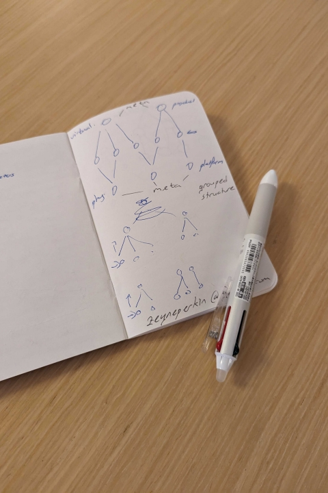
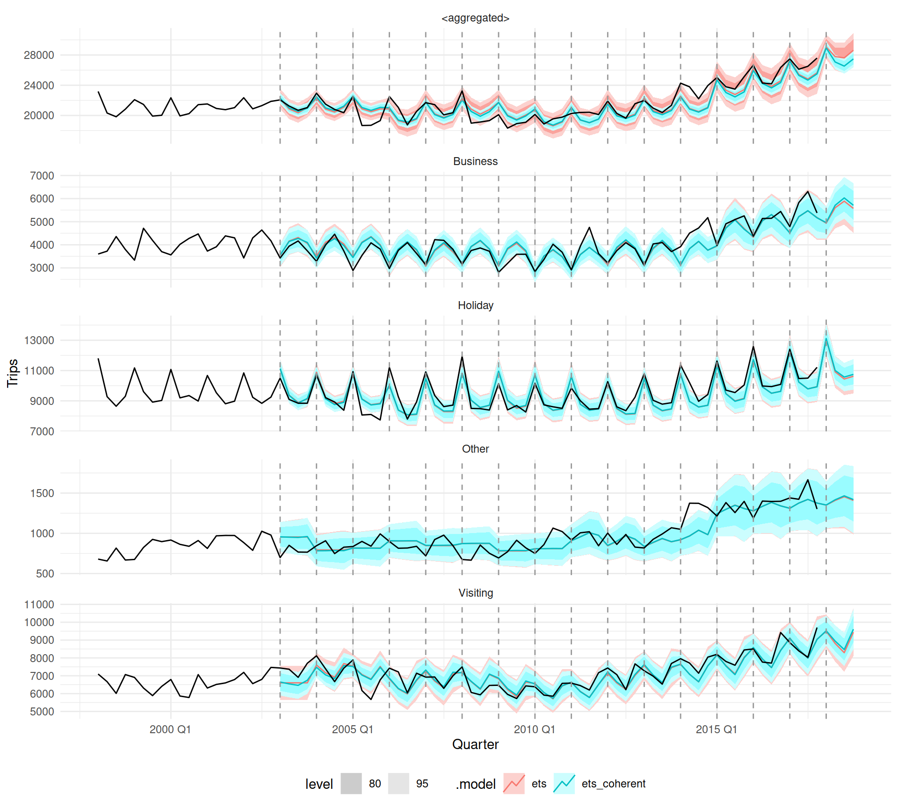
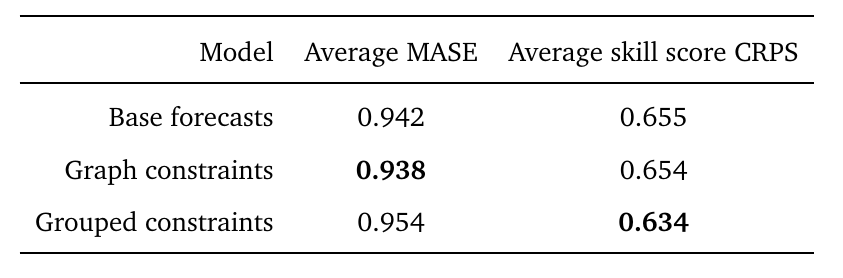
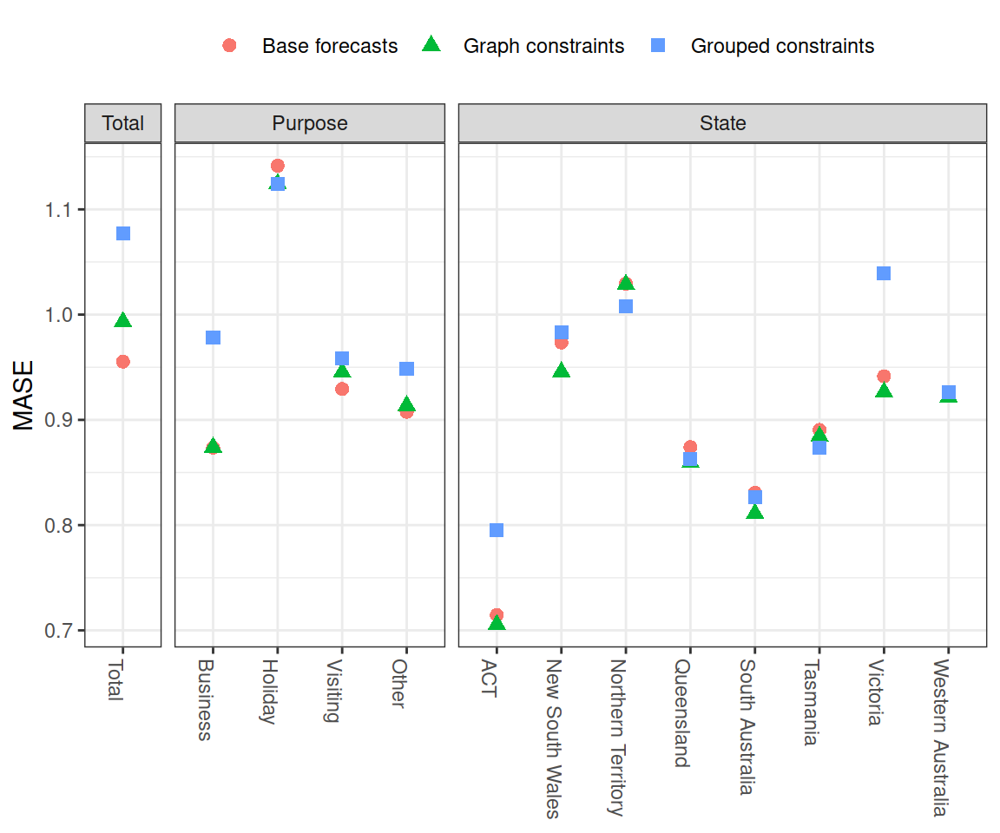
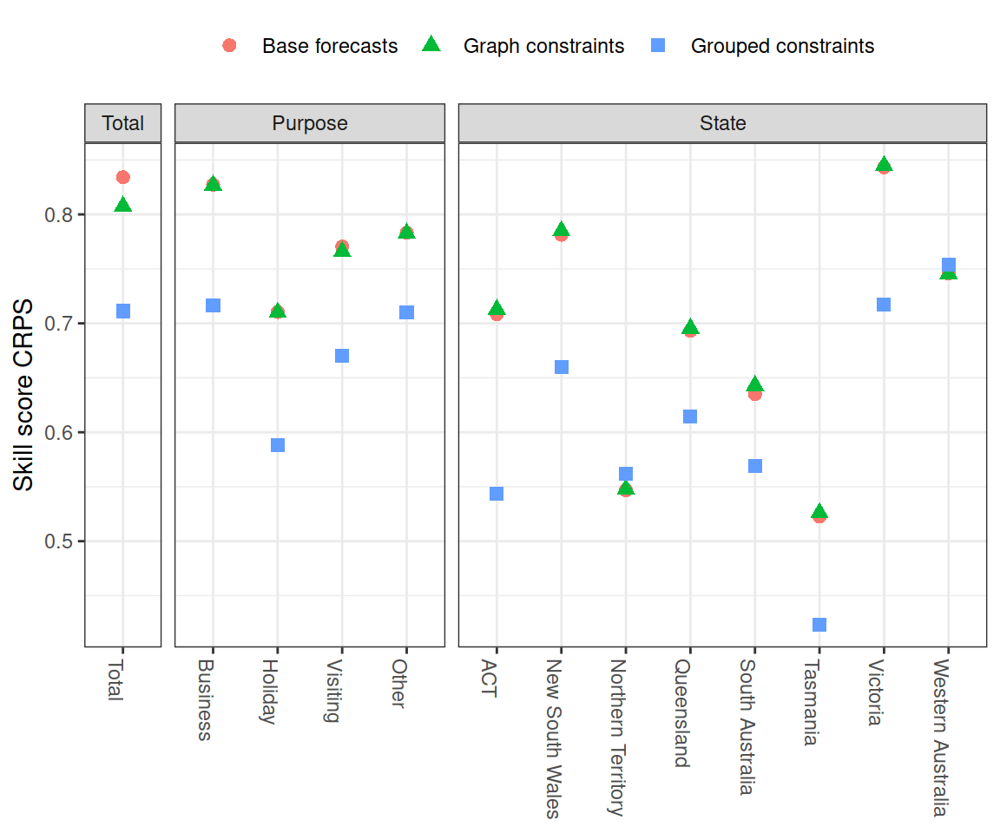
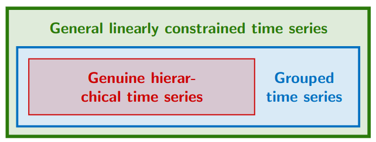

## {}

::: columns3
::: {.column width="37.5%"}
:::
::: {.column width="60%"}

::: {.title data-id="title"}
Reconciliation of structured time series forecasts with graphs
:::

::: {.dateplace}
18th October 2023, ETX6510 assignment
:::

Mitchell O'Hara-Wild, Monash University

::: {.smaller}
Supervised by Rob Hyndman and George Athanasopolous
:::

::: {.callout-link}

## Useful links

{.icon} [social.mitchelloharawild.com](https://social.mitchelloharawild.com/)

{.icon} [slides.mitchelloharawild.com/etx6510](https://slides.mitchelloharawild.com/etx6510)

{.icon} [mitchelloharawild/talk-etx6510](https://github.com/mitchelloharawild/talk-etx6510)

:::

:::
:::

{.image-left}

## The basics of reconciliation

::: columns
::: {.column width="60%"}

::: {.callout-question}

## How many tourists will visit Melbourne?

::: {.fragment .fade-in}
Forecast $\text{Visitors}_{T+h|T}$ with a suitable model and data.
:::

:::

::: {.fragment .fade-in}
::: {.callout-question}
## How many visitors are from Australia and overseas?

::: {.fragment .fade-in}
Forecast $\text{Interstate}_{T+h|T}$ and $\text{International}_{T+h|T}$ with

suitable models and data.
:::
:::
:::

::: {.fragment .fade-in}
::: {.callout-important}
## Something doesn't add up here...

Independently produced forecasts are [**incoherent**]{.danger},

$\text{Visitors}_{T+h|T} \neq \text{Interstate}_{T+h|T} + \text{International}_{T+h|T}$.
:::
:::

:::
:::

{.image-right}

## {}
### Coherency constraints

::: columns
::: {.column width="60%"}

::: {.callout-tip}

## Impose constraints to ensure coherency

Adjust the forecasts to satisfy the constraint

$\text{Visitors}_{T+h|T} = \text{Interstate}_{T+h|T} + \text{International}_{T+h|T}$.

:::

::: {.fragment .fade-in}

::: {.callout-note}
## Structural representation

Constraints can be represented using matrices:

$$
\begin{bmatrix}
  \text{Visitors}_{t} \\
  \text{Interstate}_{t} \\
  \text{International}_{t} \\
\end{bmatrix}
=
\begin{bmatrix}
  1 & 1 \\
  1 & 0\\
  0 & 1 \\
\end{bmatrix}
\begin{bmatrix}
  \text{Interstate}_{t} \\
  \text{International}_{t} \\
\end{bmatrix}
$$

or compactly, $\mathbf{y}_t = \mathbf{S} \mathbf{b}_t$

:::
:::

::: {.fragment .fade-in}
::: {.callout-paper}
More information in @hyndman2011.
:::
:::

:::
:::

{.image-right}

## {}
### Coherency constraints

::: columns
::: {.column width="60%"}

::: {.fragment .fade-in}

::: {.callout-note}
## Zero-constrained representation

Alternatively, the constraints can also be described with

$$
\begin{bmatrix}
  1 & -1 & -1 \\
\end{bmatrix}
\begin{bmatrix}
  \text{Visitors}_{t} \\
  \text{Interstate}_{t} \\
  \text{International}_{t} \\
\end{bmatrix}
=
\begin{bmatrix}
0
\end{bmatrix}
$$

or compactly, $\mathbf{C}\mathbf{y}_t = \mathbf{0}$.

:::
:::

::: {.fragment .fade-in}
::: {.callout-tip}
It's usually easy to switch between these representations.

Both $\mathbf{C}$ and $\mathbf{S}$ share a common aggregation matrix $\mathbf{A}$.

$$
\mathbf{S} = \begin{bmatrix}
\mathbf{A}\\
\mathbf{I}_{n_b}
\end{bmatrix},\hspace{2em}
\mathbf{C} = \begin{bmatrix}
\mathbf{I}_{n_a} & -\mathbf{A}
\end{bmatrix}.
$$

:::
:::

:::
:::

{.image-right}


## {.fragment-remove}

::: columns

::: {.column width="40%"}
:::
::: {.column width="60%"}
### Coherency constraints

::: {.callout-important}
## These representations can't represent all constraints

Hierarchical and grouped constraints work well, since they have single top series and common bottom series.
:::

::: {.fragment .fade-in}
::: {.callout-paper}
## General linearly constrained time series

@girolimetto2023point generalise the zero-constrained representation to support any constraint.
:::
:::

::: {.fragment .fade-in}
::: {.callout-tip}
## Graph representation of constraints

I propose representing constraints using **directed acyclical graphs** (DAGs) which achieve the same generality with added benefits.
:::
:::


:::
:::

{.image-left}

## {.fragment-remove}

::: columns

::: {.column width="40%"}
:::
::: {.column width="60%"}
### General linear constraints

::: {.callout-tip}
## Generalisation from zero-constrained representation

::: {.fragment .fade-out fragment-index=1}
Rather than *upper and bottom* series, consider *constrained and unconstrained* series.


:::

::: {.fragment .fade-up fragment-index=1}
Similar to $\mathbf{C}$, $\mathbf{\Gamma}$ imposes zero-constraints: $\mathbf{\Gamma}\mathbf{y}_t = \mathbf{0}$.

$$
\mathbf{\Gamma} = \begin{bmatrix}
1 & 0 & -1 & -1 & -1 &  0 &  0\\
1 & 0 &  0 &  0 &  0 & -1 & -1\\
0 & 1 & -1 & -1 &  0 &  0 &  0\\
\end{bmatrix}
$$
:::

::: {.fragment .fade-up fragment-index=2}
However the structural representation and aggregation matrix $\mathbf{A}$ is hard to obtain since

$$
\mathbf{S} = \begin{bmatrix}
\mathbf{A}\\
\mathbf{I}_{n_b}
\end{bmatrix},\hspace{2em}
\mathbf{\Gamma} \neq \begin{bmatrix}
\mathbf{I}_{n_a} & -\mathbf{A}
\end{bmatrix}.
$$
:::

::: {.fragment .fade-up fragment-index=3}
For linear reconciliation, both graph coherence and 'general
linearly constrained' coherence are equivalent.
:::

:::

:::
:::

{.image-left}


## {.fragment-remove}

::: columns

::: {.column width="40%"}
:::
::: {.column width="60%"}
### General linear constraints

::: {.callout-tip}
## Generalisation from zero-constrained representation

::: {.fragment .fade-out fragment-index=1}
Use standard linear algebra techniques to transform $\mathbf{\Gamma}$ into a full rank matrix $\mathbf{\bar{U}}$ of form of $\mathbf{C}$.

$$
\mathbf{\Gamma} = \begin{bmatrix}
1 & 0 & -1 & -1 & -1 &  0 &  0\\
1 & 0 &  0 &  0 &  0 & -1 & -1\\
0 & 1 & -1 & -1 &  0 &  0 &  0\\
\end{bmatrix}
$$
Two options are proposed:

* Reduced row echelon form [@meyer2023matrix]
* QR decomposition [@lyche2020numerical]

:::

::: {.fragment .fade-up fragment-index=1}
::: {.fragment .fade-out fragment-index=2}
Applying this technique provides an equivalent matrix from which $\mathbf{A}$ is easily obtained.


$$
\mathbf{\bar{U}} = \left[\begin{array}{ccc:cccc}
1 & 0 & 0 &  0 &  0 & -1 & -1\\
0 & 1 & 0 &  0 &  1 & -1 & -1\\
0 & 0 & 1 &  1 &  1 & -1 & -1\\
\end{array}\right]
$$
:::
:::

::: {.fragment .fade-up fragment-index=2}
From which a "structural-like" representation, $\mathbf{y}_t = \mathbf{\bar{S}}\mathbf{b}_t$ can be constructed:

$$
\mathbf{\bar{S}} = \left[\begin{array}{cccc}
0 &  0 & -1 & -1\\
0 &  1 & -1 & -1\\
1 &  1 & -1 & -1\\\hdashline
1 & 0 & 0 & 0\\
0 & 1 & 0 & 0\\
0 & 0 & 1 & 0\\
0 & 0 & 0 & 1
\end{array}\right].
$$
:::
:::

:::
:::

{.image-left}

## {.fragment-remove}

::: columns

::: {.column width="40%"}
:::
::: {.column width="60%"}
### Graph constraints

::: {.callout-tip}
## A novel representation of coherency constraints

Graphs are often used to visualise the constraints...

but can they also be useful in imposing the constraints?

:::

::: {.callout-note}
## Graphs are used widely in computer science

Representing coherency constraints using graphs would:

* introduce **graph terminology** for navigating structures
* **simplify** the description of the **coherency constraints**
* allow representation of **non-linear** relationships
* **unify tools** for visualisation and reconciliation

:::

:::
:::

{.image-left}


## {}

::: columns
::: {.column width="40%"}
:::
::: {.column width="60%"}
### Hierarchical coherence

::: {.callout-note}
## Each aggregate has a single constraint

The basic constraint shown before is '[**hierarchical**]{.term}'


::: {.cell hash='index_cache/revealjs/unnamed-chunk-3_a08e87e70d8574c9ec6315df81590ef4'}
::: {.cell-output-display}

```{=html}
<div id="htmlwidget-5c8ec3bfe287ca8ddb93" style="width:600px;height:300px;" class="visNetwork html-widget "></div>
<script type="application/json" data-for="htmlwidget-5c8ec3bfe287ca8ddb93">{"x":{"nodes":{"label":["Visitors","Interstate","International"],"id":[1,2,3],"level":[0,1,1]},"edges":{"from":[1,1],"to":[2,3]},"nodesToDataframe":true,"edgesToDataframe":true,"options":{"width":"100%","height":"100%","nodes":{"shape":"dot","font":{"size":16}},"manipulation":{"enabled":false},"layout":{"hierarchical":{"enabled":true,"direction":"UD","shakeTowards":"leaves"}},"edges":{"arrows":"to","scaling":{"label":{"enabled":false}}}},"groups":null,"width":600,"height":300,"idselection":{"enabled":false,"style":"width: 150px; height: 26px","useLabels":true,"main":"Select by id"},"byselection":{"enabled":false,"style":"width: 150px; height: 26px","multiple":false,"hideColor":"rgba(200,200,200,0.5)","highlight":false},"main":null,"submain":null,"footer":null,"background":"rgba(0, 0, 0, 0)","highlight":{"enabled":true,"hoverNearest":false,"degree":{"from":50000,"to":0},"algorithm":"hierarchical","hideColor":"rgba(200,200,200,0.5)","labelOnly":true},"collapse":{"enabled":true,"fit":false,"resetHighlight":true,"clusterOptions":{"fixed":true,"physics":true},"keepCoord":true,"labelSuffix":"(cluster)"},"tree":{"updateShape":true,"shapeVar":"dot","shapeY":"square"}},"evals":[],"jsHooks":[]}</script>
```

:::
:::

:::

::: {.fragment .fade-in}
In graph terms, this is known as a [**polytree**]{.term}.
:::

:::
:::

{.image-left}


## {}

::: columns
::: {.column width="60%"}
### Grouped coherence

::: {.callout-note}
## Considering origin and purpose

Attendance can be disaggregated by both **origin** and **purpose**...

::: columns
::: {.column width="50%"}

::: {.cell hash='index_cache/revealjs/unnamed-chunk-4_905f875a2a29ab1c5cfdbc9f4dbe8b69'}
::: {.cell-output-display}

```{=html}
<div id="htmlwidget-a7453cbdb1b8e3e7912d" style="width:300px;height:300px;" class="visNetwork html-widget "></div>
<script type="application/json" data-for="htmlwidget-a7453cbdb1b8e3e7912d">{"x":{"nodes":{"label":["Visitors","Interstate","International"],"id":[1,2,3],"level":[0,1,1]},"edges":{"from":[1,1],"to":[2,3]},"nodesToDataframe":true,"edgesToDataframe":true,"options":{"width":"100%","height":"100%","nodes":{"shape":"dot","font":{"size":16}},"manipulation":{"enabled":false},"layout":{"hierarchical":{"enabled":true,"direction":"UD","shakeTowards":"leaves"}},"edges":{"arrows":"to","scaling":{"label":{"enabled":false}}}},"groups":null,"width":300,"height":300,"idselection":{"enabled":false,"style":"width: 150px; height: 26px","useLabels":true,"main":"Select by id"},"byselection":{"enabled":false,"style":"width: 150px; height: 26px","multiple":false,"hideColor":"rgba(200,200,200,0.5)","highlight":false},"main":null,"submain":null,"footer":null,"background":"rgba(0, 0, 0, 0)","highlight":{"enabled":true,"hoverNearest":false,"degree":{"from":50000,"to":0},"algorithm":"hierarchical","hideColor":"rgba(200,200,200,0.5)","labelOnly":true},"collapse":{"enabled":true,"fit":false,"resetHighlight":true,"clusterOptions":{"fixed":true,"physics":true},"keepCoord":true,"labelSuffix":"(cluster)"},"tree":{"updateShape":true,"shapeVar":"dot","shapeY":"square"}},"evals":[],"jsHooks":[]}</script>
```

:::
:::

:::
::: {.column width="50%"}

::: {.cell hash='index_cache/revealjs/unnamed-chunk-5_4e396f15ab398bae5432b8700dad07e0'}
::: {.cell-output-display}

```{=html}
<div id="htmlwidget-3927a9a3c92e5b7855b6" style="width:300px;height:300px;" class="visNetwork html-widget "></div>
<script type="application/json" data-for="htmlwidget-3927a9a3c92e5b7855b6">{"x":{"nodes":{"label":["Visitors","Business","Holiday"],"id":[1,2,3],"level":[0,1,1]},"edges":{"from":[1,1],"to":[2,3]},"nodesToDataframe":true,"edgesToDataframe":true,"options":{"width":"100%","height":"100%","nodes":{"shape":"dot","font":{"size":16}},"manipulation":{"enabled":false},"layout":{"hierarchical":{"enabled":true,"direction":"UD","shakeTowards":"leaves"}},"edges":{"arrows":"to","scaling":{"label":{"enabled":false}}}},"groups":null,"width":300,"height":300,"idselection":{"enabled":false,"style":"width: 150px; height: 26px","useLabels":true,"main":"Select by id"},"byselection":{"enabled":false,"style":"width: 150px; height: 26px","multiple":false,"hideColor":"rgba(200,200,200,0.5)","highlight":false},"main":null,"submain":null,"footer":null,"background":"rgba(0, 0, 0, 0)","highlight":{"enabled":true,"hoverNearest":false,"degree":{"from":50000,"to":0},"algorithm":"hierarchical","hideColor":"rgba(200,200,200,0.5)","labelOnly":true},"collapse":{"enabled":true,"fit":false,"resetHighlight":true,"clusterOptions":{"fixed":true,"physics":true},"keepCoord":true,"labelSuffix":"(cluster)"},"tree":{"updateShape":true,"shapeVar":"dot","shapeY":"square"}},"evals":[],"jsHooks":[]}</script>
```

:::
:::

:::
:::
:::
:::
:::

{.image-right}


## {}

::: columns
::: {.column width="60%"}
### Grouped coherence

::: {.callout-note}
## Considering origin and purpose

and then further disaggregated by the other.

::: columns
::: {.column width="50%"}

::: {.cell hash='index_cache/revealjs/unnamed-chunk-6_c6ada2a1182818154cc0105a9cf456b6'}
::: {.cell-output-display}

```{=html}
<div id="htmlwidget-0f24f99c25c556778004" style="width:300px;height:400px;" class="visNetwork html-widget "></div>
<script type="application/json" data-for="htmlwidget-0f24f99c25c556778004">{"x":{"nodes":{"label":["Visitors","Interstate","International","Interstate\n& Business","Interstate\n& Holiday","International\n& Business","International\n& Holiday"],"id":[1,2,3,4,5,6,7],"level":[0,1,1,2,2,2,2]},"edges":{"from":[1,1,2,2,3,3],"to":[2,3,4,5,6,7]},"nodesToDataframe":true,"edgesToDataframe":true,"options":{"width":"100%","height":"100%","nodes":{"shape":"dot","font":{"size":16}},"manipulation":{"enabled":false},"layout":{"hierarchical":{"enabled":true,"direction":"UD","shakeTowards":"leaves"}},"edges":{"arrows":"to","scaling":{"label":{"enabled":false}}}},"groups":null,"width":300,"height":400,"idselection":{"enabled":false,"style":"width: 150px; height: 26px","useLabels":true,"main":"Select by id"},"byselection":{"enabled":false,"style":"width: 150px; height: 26px","multiple":false,"hideColor":"rgba(200,200,200,0.5)","highlight":false},"main":null,"submain":null,"footer":null,"background":"rgba(0, 0, 0, 0)","highlight":{"enabled":true,"hoverNearest":false,"degree":{"from":50000,"to":0},"algorithm":"hierarchical","hideColor":"rgba(200,200,200,0.5)","labelOnly":true},"collapse":{"enabled":true,"fit":false,"resetHighlight":true,"clusterOptions":{"fixed":true,"physics":true},"keepCoord":true,"labelSuffix":"(cluster)"},"tree":{"updateShape":true,"shapeVar":"dot","shapeY":"square"}},"evals":[],"jsHooks":[]}</script>
```

:::
:::

:::
::: {.column width="50%"}

::: {.cell hash='index_cache/revealjs/unnamed-chunk-7_8ba943e35dee9d6729a68ce2c6b68081'}
::: {.cell-output-display}

```{=html}
<div id="htmlwidget-c412261896de96d702c8" style="width:300px;height:400px;" class="visNetwork html-widget "></div>
<script type="application/json" data-for="htmlwidget-c412261896de96d702c8">{"x":{"nodes":{"label":["Visitors","Business","Holiday","Business\n& Interstate","Business\n& International","Holiday\n& Interstate","Holiday\n& International"],"id":[1,2,3,4,5,6,7],"level":[0,1,1,2,2,2,2]},"edges":{"from":[1,1,2,2,3,3],"to":[2,3,4,5,6,7]},"nodesToDataframe":true,"edgesToDataframe":true,"options":{"width":"100%","height":"100%","nodes":{"shape":"dot","font":{"size":16}},"manipulation":{"enabled":false},"layout":{"hierarchical":{"enabled":true,"direction":"UD","shakeTowards":"leaves"}},"edges":{"arrows":"to","scaling":{"label":{"enabled":false}}}},"groups":null,"width":300,"height":400,"idselection":{"enabled":false,"style":"width: 150px; height: 26px","useLabels":true,"main":"Select by id"},"byselection":{"enabled":false,"style":"width: 150px; height: 26px","multiple":false,"hideColor":"rgba(200,200,200,0.5)","highlight":false},"main":null,"submain":null,"footer":null,"background":"rgba(0, 0, 0, 0)","highlight":{"enabled":true,"hoverNearest":false,"degree":{"from":50000,"to":0},"algorithm":"hierarchical","hideColor":"rgba(200,200,200,0.5)","labelOnly":true},"collapse":{"enabled":true,"fit":false,"resetHighlight":true,"clusterOptions":{"fixed":true,"physics":true},"keepCoord":true,"labelSuffix":"(cluster)"},"tree":{"updateShape":true,"shapeVar":"dot","shapeY":"square"}},"evals":[],"jsHooks":[]}</script>
```

:::
:::

:::
:::

A [**grouped**]{.term} structure has the **same top and bottom series**.

:::
:::
:::

{.image-right}

## {}

::: columns
::: {.column width="60%"}
### Grouped coherence

::: {.callout-note}
## Considering origin and purpose

The [**grouped**]{.term} structure can be plotted in a single graph.


::: {.cell hash='index_cache/revealjs/unnamed-chunk-8_da7a0a48122cd231fb83a66cdd98da1f'}
::: {.cell-output-display}

```{=html}
<div id="htmlwidget-4102d35ec91ffea1ab29" style="width:600px;height:400px;" class="visNetwork html-widget "></div>
<script type="application/json" data-for="htmlwidget-4102d35ec91ffea1ab29">{"x":{"nodes":{"label":["Visitors","Business","Holiday","Interstate","International","Business\n& Interstate","Business\n& International","Holiday\n& Interstate","Holiday\n& International"],"id":[1,2,3,4,5,6,7,8,9],"x":[-0.003371926391818159,-0.8582194521345512,0.86356954610132,0.172705587374925,-0.1708640521216115,-0.6628108638547205,-1,1,0.6736804153398088],"y":[-0.01390576951516009,0.1644008084973776,-0.1675798740901829,0.8533471780243223,-0.8822395672944368,1,-0.6855433690152226,0.6766420294961848,-1]},"edges":{"from":[1,1,1,1,2,4,2,5,3,4,3,5],"to":[2,3,4,5,6,6,7,7,8,8,9,9],"color":["#C87A8A","#C87A8A","#6B9D59","#6B9D59","#C87A8A","#6B9D59","#C87A8A","#6B9D59","#C87A8A","#6B9D59","#C87A8A","#6B9D59"]},"nodesToDataframe":true,"edgesToDataframe":true,"options":{"width":"100%","height":"100%","nodes":{"shape":"dot","physics":false,"size":20},"manipulation":{"enabled":false},"edges":{"smooth":false,"width":3,"arrows":"to","scaling":{"label":{"enabled":false}}},"physics":{"stabilization":false}},"groups":null,"width":600,"height":400,"idselection":{"enabled":false,"style":"width: 150px; height: 26px","useLabels":true,"main":"Select by id"},"byselection":{"enabled":false,"style":"width: 150px; height: 26px","multiple":false,"hideColor":"rgba(200,200,200,0.5)","highlight":false},"main":null,"submain":null,"footer":null,"background":"rgba(0, 0, 0, 0)","igraphlayout":{"type":"square"},"highlight":{"enabled":true,"hoverNearest":false,"degree":{"from":50000,"to":0},"algorithm":"all","hideColor":"rgba(200,200,200,0.5)","labelOnly":true},"collapse":{"enabled":false,"fit":false,"resetHighlight":true,"clusterOptions":null,"keepCoord":true,"labelSuffix":"(cluster)"},"tree":{"updateShape":true,"shapeVar":"dot","shapeY":"square"}},"evals":[],"jsHooks":[]}</script>
```

:::
:::


::: {.fragment .fade-in}
In graph terms, this is a [**directed acyclical graph**]{.term} (DAG).
:::
:::

:::
:::

{.image-right}


## {}

::: columns
::: {.column width="40%"}
:::
::: {.column width="60%"}
### Temporal coherence

::: {.callout-note}
A time series can be disaggregated by temporal granularity


::: {.cell hash='index_cache/revealjs/unnamed-chunk-9_49a33a651060fed51898706c3fabdd22'}
::: {.cell-output-display}

```{=html}
<div id="htmlwidget-97cf83aa265175d83328" style="width:600px;height:200px;" class="visNetwork html-widget "></div>
<script type="application/json" data-for="htmlwidget-97cf83aa265175d83328">{"x":{"nodes":{"label":["Year","Q1","Q2","Q3","Q4","Jan","Feb","Mar","Apr","May","Jun","Jul","Aug","Sep","Oct","Nov","Dec"],"id":[1,2,3,4,5,6,7,8,9,10,11,12,13,14,15,16,17],"level":[0,1,1,1,1,2,2,2,2,2,2,2,2,2,2,2,2]},"edges":{"from":[1,1,1,1,2,2,2,3,3,3,4,4,4,5,5,5],"to":[2,3,4,5,6,7,8,9,10,11,12,13,14,15,16,17]},"nodesToDataframe":true,"edgesToDataframe":true,"options":{"width":"100%","height":"100%","nodes":{"shape":"dot","font":{"size":40}},"manipulation":{"enabled":false},"layout":{"hierarchical":{"enabled":true,"direction":"UD","shakeTowards":"leaves"}},"edges":{"arrows":"to","scaling":{"label":{"enabled":false}}}},"groups":null,"width":600,"height":200,"idselection":{"enabled":false,"style":"width: 150px; height: 26px","useLabels":true,"main":"Select by id"},"byselection":{"enabled":false,"style":"width: 150px; height: 26px","multiple":false,"hideColor":"rgba(200,200,200,0.5)","highlight":false},"main":null,"submain":null,"footer":null,"background":"rgba(0, 0, 0, 0)","highlight":{"enabled":true,"hoverNearest":false,"degree":{"from":50000,"to":0},"algorithm":"hierarchical","hideColor":"rgba(200,200,200,0.5)","labelOnly":true},"collapse":{"enabled":true,"fit":false,"resetHighlight":true,"clusterOptions":{"fixed":true,"physics":true},"keepCoord":true,"labelSuffix":"(cluster)"},"tree":{"updateShape":true,"shapeVar":"dot","shapeY":"square"}},"evals":[],"jsHooks":[]}</script>
```

:::
:::

:::

::: {.callout-paper}
Temporal reconciliation is described in @ATHANASOPOULOS201760.
:::

::: {.fragment .fade-in}
::: {.callout-question}
## What type of coherence structure is this?

::: {.fragment .fade-in}
This is a [**polytree**]{.term}, so this structure is [**hierarchical**]{.term}.
:::
:::
:::
:::
:::

{.image-left}


## {}

::: columns
::: {.column width="40%"}
:::
::: {.column width="60%"}
### Temporal coherence


::: {.cell hash='index_cache/revealjs/unnamed-chunk-10_9737742f32f86b089902d144c114ca48'}
::: {.cell-output-display}

```{=html}
<div id="htmlwidget-807b348350d6ecc1cf33" style="width:700px;height:200px;" class="visNetwork html-widget "></div>
<script type="application/json" data-for="htmlwidget-807b348350d6ecc1cf33">{"x":{"nodes":{"label":["Year","Q1","Q2","Q3","Q4","Jan","Feb","Mar","Apr","May","Jun","Jul","Aug","Sep","Oct","Nov","Dec"],"id":[1,2,3,4,5,6,7,8,9,10,11,12,13,14,15,16,17],"level":[0,1,1,1,1,2,2,2,2,2,2,2,2,2,2,2,2]},"edges":{"from":[1,1,1,1,2,2,2,3,3,3,4,4,4,5,5,5],"to":[2,3,4,5,6,7,8,9,10,11,12,13,14,15,16,17]},"nodesToDataframe":true,"edgesToDataframe":true,"options":{"width":"100%","height":"100%","nodes":{"shape":"dot","font":{"size":40}},"manipulation":{"enabled":false},"layout":{"hierarchical":{"enabled":true,"direction":"UD","shakeTowards":"leaves"}},"edges":{"arrows":"to","scaling":{"label":{"enabled":false}}}},"groups":null,"width":700,"height":200,"idselection":{"enabled":false,"style":"width: 150px; height: 26px","useLabels":true,"main":"Select by id"},"byselection":{"enabled":false,"style":"width: 150px; height: 26px","multiple":false,"hideColor":"rgba(200,200,200,0.5)","highlight":false},"main":null,"submain":null,"footer":null,"background":"rgba(0, 0, 0, 0)","highlight":{"enabled":true,"hoverNearest":false,"degree":{"from":50000,"to":0},"algorithm":"hierarchical","hideColor":"rgba(200,200,200,0.5)","labelOnly":true},"collapse":{"enabled":true,"fit":false,"resetHighlight":true,"clusterOptions":{"fixed":true,"physics":true},"keepCoord":true,"labelSuffix":"(cluster)"},"tree":{"updateShape":true,"shapeVar":"dot","shapeY":"square"}},"evals":[],"jsHooks":[]}</script>
```

:::
:::

::: {.cell hash='index_cache/revealjs/unnamed-chunk-11_9d9cf04e7a54275b110d26f132e864b4'}
::: {.cell-output-display}

```{=html}
<div id="htmlwidget-6edc68609ca10e7a926e" style="width:700px;height:200px;" class="visNetwork html-widget "></div>
<script type="application/json" data-for="htmlwidget-6edc68609ca10e7a926e">{"x":{"nodes":{"label":["Year","Jan-Apr","May-Aug","Sep-Dec","Jan","Feb","Mar","Apr","May","Jun","Jul","Aug","Sep","Oct","Nov","Dec"],"id":[1,2,3,4,5,6,7,8,9,10,11,12,13,14,15,16],"level":[0,1,1,1,2,2,2,2,2,2,2,2,2,2,2,2]},"edges":{"from":[1,1,1,2,2,2,2,3,3,3,3,4,4,4,4],"to":[2,3,4,5,6,7,8,9,10,11,12,13,14,15,16]},"nodesToDataframe":true,"edgesToDataframe":true,"options":{"width":"100%","height":"100%","nodes":{"shape":"dot","font":{"size":40}},"manipulation":{"enabled":false},"layout":{"hierarchical":{"enabled":true,"direction":"UD","shakeTowards":"leaves"}},"edges":{"arrows":"to","scaling":{"label":{"enabled":false}}}},"groups":null,"width":700,"height":200,"idselection":{"enabled":false,"style":"width: 150px; height: 26px","useLabels":true,"main":"Select by id"},"byselection":{"enabled":false,"style":"width: 150px; height: 26px","multiple":false,"hideColor":"rgba(200,200,200,0.5)","highlight":false},"main":null,"submain":null,"footer":null,"background":"rgba(0, 0, 0, 0)","highlight":{"enabled":true,"hoverNearest":false,"degree":{"from":50000,"to":0},"algorithm":"hierarchical","hideColor":"rgba(200,200,200,0.5)","labelOnly":true},"collapse":{"enabled":true,"fit":false,"resetHighlight":true,"clusterOptions":{"fixed":true,"physics":true},"keepCoord":true,"labelSuffix":"(cluster)"},"tree":{"updateShape":true,"shapeVar":"dot","shapeY":"square"}},"evals":[],"jsHooks":[]}</script>
```

:::
:::


::: {.fragment .fade-in}
::: {.callout-question}
## What type of coherence structure is this?
::: {.fragment .fade-in}
This structure has the same top and bottom series, so 

temporal coherence is a [**grouped**]{.term} constraint.
:::
:::
:::
:::
:::

{.image-left}

## {}

::: columns
::: {.column width="40%"}
:::
::: {.column width="60%"}
### Temporal coherence

::: {.callout-tip}

Temporal coherence constraints are [**grouped**]{.term} can also be represented with [**directed acyclical graphs**]{.term} (DAGs).


::: {.cell hash='index_cache/revealjs/unnamed-chunk-12_303f110793675bc8b1b71069f2d33f2a'}
::: {.cell-output-display}

```{=html}
<div id="htmlwidget-96543267edf57fd6db08" style="width:700px;height:500px;" class="visNetwork html-widget "></div>
<script type="application/json" data-for="htmlwidget-96543267edf57fd6db08">{"x":{"nodes":{"label":["Year","Q1","Q2","Q3","Q4","Jan-Apr","May-Aug","Sep-Dec","Jan","Feb","Mar","Apr","May","Jun","Jul","Aug","Sep","Oct","Nov","Dec"],"id":[1,2,3,4,5,6,7,8,9,10,11,12,13,14,15,16,17,18,19,20],"x":[-0.05400594153204008,-0.4025836122675311,0.5279899127542234,0.3499252905890411,-0.6550819584534231,-0.1840021427311581,0.6690920750504299,-0.4897559363236491,-0.5080661329043736,-0.2400351501051694,-0.6834033281094694,0.3225316288369899,0.9185469261158925,1,0.7265907610337898,0.8740049766555253,-0.03854619266894377,-1,-0.9357883705518357,-0.7009937986365129],"y":[-0.08026365469781349,0.5549817302860942,0.2565900683007281,-0.602076668830982,-0.5290851774580543,0.6295752330530142,-0.2153387036532498,-0.6767056635977524,0.9669927230446371,1,0.7563276781751973,0.6913868441606599,0.2322349843697402,0.03229075048331187,-0.7226803954898391,-0.5592963964373876,-0.9135472332778896,-0.5978961503510797,-0.8600785125976133,-1]},"edges":{"from":[1,1,1,1,1,1,1,2,2,2,3,3,3,4,4,4,5,5,5,6,6,6,6,7,7,7,7,8,8,8,8],"to":[2,3,4,5,6,7,8,9,10,11,12,13,14,15,16,17,18,19,20,9,10,11,12,13,14,15,16,17,18,19,20],"grp":[1,1,1,1,2,2,2,1,1,1,1,1,1,1,1,1,1,1,1,2,2,2,2,2,2,2,2,2,2,2,2],"color":["#C87A8A","#C87A8A","#C87A8A","#C87A8A","#6B9D59","#6B9D59","#6B9D59","#C87A8A","#C87A8A","#C87A8A","#C87A8A","#C87A8A","#C87A8A","#C87A8A","#C87A8A","#C87A8A","#C87A8A","#C87A8A","#C87A8A","#6B9D59","#6B9D59","#6B9D59","#6B9D59","#6B9D59","#6B9D59","#6B9D59","#6B9D59","#6B9D59","#6B9D59","#6B9D59","#6B9D59"]},"nodesToDataframe":true,"edgesToDataframe":true,"options":{"width":"100%","height":"100%","nodes":{"shape":"dot","physics":false,"size":20,"font":{"size":30}},"manipulation":{"enabled":false},"edges":{"smooth":false,"width":3,"arrows":"to","scaling":{"label":{"enabled":false}}},"physics":{"stabilization":false}},"groups":null,"width":700,"height":500,"idselection":{"enabled":false,"style":"width: 150px; height: 26px","useLabels":true,"main":"Select by id"},"byselection":{"enabled":false,"style":"width: 150px; height: 26px","multiple":false,"hideColor":"rgba(200,200,200,0.5)","highlight":false},"main":null,"submain":null,"footer":null,"background":"rgba(0, 0, 0, 0)","igraphlayout":{"type":"square"},"highlight":{"enabled":true,"hoverNearest":false,"degree":{"from":50000,"to":0},"algorithm":"all","hideColor":"rgba(200,200,200,0.5)","labelOnly":true},"collapse":{"enabled":false,"fit":false,"resetHighlight":true,"clusterOptions":null,"keepCoord":true,"labelSuffix":"(cluster)"},"tree":{"updateShape":true,"shapeVar":"dot","shapeY":"square"}},"evals":[],"jsHooks":[]}</script>
```

:::
:::

:::

:::
:::

{.image-left}

## {.fragment-remove}

::: columns
::: {.column width="40%"}
:::
::: {.column width="60%"}
### Cross-temporal coherence

::: {.callout-note}

Since both [**grouped**]{.term} and [**temporal**]{.term} coherence are DAGs, the interaction between them is a single DAG.

::: {.fragment .fade-out fragment-index=1}
::: columns
::: {.column width="50%"}

::: {.cell hash='index_cache/revealjs/unnamed-chunk-13_f20b2a6fd431c8c94f0f8628229c9360'}
::: {.cell-output-display}

```{=html}
<div id="htmlwidget-ddd4d0f15196673d5a4f" style="width:300px;height:300px;" class="visNetwork html-widget "></div>
<script type="application/json" data-for="htmlwidget-ddd4d0f15196673d5a4f">{"x":{"nodes":{"label":["Year","Q1","Q2","Q3","Q4","Jan-Apr","May-Aug","Sep-Dec","Jan","Feb","Mar","Apr","May","Jun","Jul","Aug","Sep","Oct","Nov","Dec"],"id":[1,2,3,4,5,6,7,8,9,10,11,12,13,14,15,16,17,18,19,20],"x":[-0.05400594153204008,-0.4025836122675311,0.5279899127542234,0.3499252905890411,-0.6550819584534231,-0.1840021427311581,0.6690920750504299,-0.4897559363236491,-0.5080661329043736,-0.2400351501051694,-0.6834033281094694,0.3225316288369899,0.9185469261158925,1,0.7265907610337898,0.8740049766555253,-0.03854619266894377,-1,-0.9357883705518357,-0.7009937986365129],"y":[-0.08026365469781349,0.5549817302860942,0.2565900683007281,-0.602076668830982,-0.5290851774580543,0.6295752330530142,-0.2153387036532498,-0.6767056635977524,0.9669927230446371,1,0.7563276781751973,0.6913868441606599,0.2322349843697402,0.03229075048331187,-0.7226803954898391,-0.5592963964373876,-0.9135472332778896,-0.5978961503510797,-0.8600785125976133,-1]},"edges":{"from":[1,1,1,1,1,1,1,2,2,2,3,3,3,4,4,4,5,5,5,6,6,6,6,7,7,7,7,8,8,8,8],"to":[2,3,4,5,6,7,8,9,10,11,12,13,14,15,16,17,18,19,20,9,10,11,12,13,14,15,16,17,18,19,20],"grp":[1,1,1,1,2,2,2,1,1,1,1,1,1,1,1,1,1,1,1,2,2,2,2,2,2,2,2,2,2,2,2],"color":["#C87A8A","#C87A8A","#C87A8A","#C87A8A","#6B9D59","#6B9D59","#6B9D59","#C87A8A","#C87A8A","#C87A8A","#C87A8A","#C87A8A","#C87A8A","#C87A8A","#C87A8A","#C87A8A","#C87A8A","#C87A8A","#C87A8A","#6B9D59","#6B9D59","#6B9D59","#6B9D59","#6B9D59","#6B9D59","#6B9D59","#6B9D59","#6B9D59","#6B9D59","#6B9D59","#6B9D59"]},"nodesToDataframe":true,"edgesToDataframe":true,"options":{"width":"100%","height":"100%","nodes":{"shape":"dot","physics":false,"size":20,"font":{"size":30}},"manipulation":{"enabled":false},"edges":{"smooth":false,"width":3,"arrows":"to","scaling":{"label":{"enabled":false}}},"physics":{"stabilization":false}},"groups":null,"width":300,"height":300,"idselection":{"enabled":false,"style":"width: 150px; height: 26px","useLabels":true,"main":"Select by id"},"byselection":{"enabled":false,"style":"width: 150px; height: 26px","multiple":false,"hideColor":"rgba(200,200,200,0.5)","highlight":false},"main":null,"submain":null,"footer":null,"background":"rgba(0, 0, 0, 0)","igraphlayout":{"type":"square"},"highlight":{"enabled":true,"hoverNearest":false,"degree":{"from":50000,"to":0},"algorithm":"all","hideColor":"rgba(200,200,200,0.5)","labelOnly":true},"collapse":{"enabled":false,"fit":false,"resetHighlight":true,"clusterOptions":null,"keepCoord":true,"labelSuffix":"(cluster)"},"tree":{"updateShape":true,"shapeVar":"dot","shapeY":"square"}},"evals":[],"jsHooks":[]}</script>
```

:::
:::

:::
::: {.column width="50%"}

::: {.cell hash='index_cache/revealjs/unnamed-chunk-14_428dd7f8dd51f9832dca4375eafec2f1'}
::: {.cell-output-display}

```{=html}
<div id="htmlwidget-27248494c5f5b74128df" style="width:600px;height:400px;" class="visNetwork html-widget "></div>
<script type="application/json" data-for="htmlwidget-27248494c5f5b74128df">{"x":{"nodes":{"label":["Visitors","Business","Holiday","Interstate","International","Business\n& Interstate","Business\n& International","Holiday\n& Interstate","Holiday\n& International"],"id":[1,2,3,4,5,6,7,8,9],"x":[-0.003371926391818159,-0.8582194521345512,0.86356954610132,0.172705587374925,-0.1708640521216115,-0.6628108638547205,-1,1,0.6736804153398088],"y":[-0.01390576951516009,0.1644008084973776,-0.1675798740901829,0.8533471780243223,-0.8822395672944368,1,-0.6855433690152226,0.6766420294961848,-1]},"edges":{"from":[1,1,1,1,2,4,2,5,3,4,3,5],"to":[2,3,4,5,6,6,7,7,8,8,9,9],"color":["#00A396","#00A396","#9189C7","#9189C7","#00A396","#9189C7","#00A396","#9189C7","#00A396","#9189C7","#00A396","#9189C7"]},"nodesToDataframe":true,"edgesToDataframe":true,"options":{"width":"100%","height":"100%","nodes":{"shape":"dot","physics":false,"size":20},"manipulation":{"enabled":false},"edges":{"smooth":false,"width":3,"arrows":"to","scaling":{"label":{"enabled":false}}},"physics":{"stabilization":false}},"groups":null,"width":600,"height":400,"idselection":{"enabled":false,"style":"width: 150px; height: 26px","useLabels":true,"main":"Select by id"},"byselection":{"enabled":false,"style":"width: 150px; height: 26px","multiple":false,"hideColor":"rgba(200,200,200,0.5)","highlight":false},"main":null,"submain":null,"footer":null,"background":"rgba(0, 0, 0, 0)","igraphlayout":{"type":"square"},"highlight":{"enabled":true,"hoverNearest":false,"degree":{"from":50000,"to":0},"algorithm":"all","hideColor":"rgba(200,200,200,0.5)","labelOnly":true},"collapse":{"enabled":false,"fit":false,"resetHighlight":true,"clusterOptions":null,"keepCoord":true,"labelSuffix":"(cluster)"},"tree":{"updateShape":true,"shapeVar":"dot","shapeY":"square"}},"evals":[],"jsHooks":[]}</script>
```

:::
:::

:::
:::
:::

::: {.fragment .fade-up fragment-index=1}

::: {.cell hash='index_cache/revealjs/unnamed-chunk-15_4f827ab960b7bc1e5bf522d9ed5c3658'}
::: {.cell-output-display}

```{=html}
<div id="htmlwidget-e0cba4ac6dd12c1e528d" style="width:600px;height:400px;" class="visNetwork html-widget "></div>
<script type="application/json" data-for="htmlwidget-e0cba4ac6dd12c1e528d">{"x":{"nodes":{"label":["Visitors","Business","Holiday","Interstate","International","Business\n& Interstate","Business\n& International","Holiday\n& Interstate","Holiday\n& International"],"image":["resources/temporal-graph-node.png","resources/temporal-graph-node.png","resources/temporal-graph-node.png","resources/temporal-graph-node.png","resources/temporal-graph-node.png","resources/temporal-graph-node.png","resources/temporal-graph-node.png","resources/temporal-graph-node.png","resources/temporal-graph-node.png"],"shape":["image","image","image","image","image","image","image","image","image"],"id":[1,2,3,4,5,6,7,8,9],"x":[-0.003371926391818159,-0.8582194521345512,0.86356954610132,0.172705587374925,-0.1708640521216115,-0.6628108638547205,-1,1,0.6736804153398088],"y":[-0.01390576951516009,0.1644008084973776,-0.1675798740901829,0.8533471780243223,-0.8822395672944368,1,-0.6855433690152226,0.6766420294961848,-1]},"edges":{"from":[1,1,1,1,2,4,2,5,3,4,3,5],"to":[2,3,4,5,6,6,7,7,8,8,9,9],"color":["#00A396","#00A396","#9189C7","#9189C7","#00A396","#9189C7","#00A396","#9189C7","#00A396","#9189C7","#00A396","#9189C7"]},"nodesToDataframe":true,"edgesToDataframe":true,"options":{"width":"100%","height":"100%","nodes":{"shape":"dot","physics":false,"size":20},"manipulation":{"enabled":false},"edges":{"smooth":false,"width":3,"arrows":"to","scaling":{"label":{"enabled":false}}},"physics":{"stabilization":false}},"groups":null,"width":600,"height":400,"idselection":{"enabled":false,"style":"width: 150px; height: 26px","useLabels":true,"main":"Select by id"},"byselection":{"enabled":false,"style":"width: 150px; height: 26px","multiple":false,"hideColor":"rgba(200,200,200,0.5)","highlight":false},"main":null,"submain":null,"footer":null,"background":"rgba(0, 0, 0, 0)","igraphlayout":{"type":"square"},"highlight":{"enabled":true,"hoverNearest":false,"degree":{"from":50000,"to":0},"algorithm":"all","hideColor":"rgba(200,200,200,0.5)","labelOnly":true},"collapse":{"enabled":false,"fit":false,"resetHighlight":true,"clusterOptions":null,"keepCoord":true,"labelSuffix":"(cluster)"},"tree":{"updateShape":true,"shapeVar":"dot","shapeY":"square"}},"evals":[],"jsHooks":[]}</script>
```

:::
:::

:::

:::

:::
:::

{.image-left}

## {}

::: columns
::: {.column width="60%"}
### Graph coherence

A [**directed acyclical graph**]{.term} does **not** require a common top and bottom series.

<br>

::: {.fragment .fade-in}

What happens if we relax this definition of grouped coherence, and use the more general DAG structure.

::: {.callout-question}
## Is it reasonable to leverage the full generality of DAGs?

::: {.fragment .fade-in}
Yes! Let's see why.
:::
:::
:::

:::
:::

{.image-right}


## {auto-animate=true}

::: columns
::: {.column width="40%"}
:::
::: {.column width="60%"}
### Unbalanced graphs

What if the coherency structure had **different bottom series**?

<br>

This often occurs in these circumstances:

1. Cross-temporal with series observed at **different granularities**.
2. Multiple **different approaches** to calculating the top series.
3. Partial coherency by **'trimming' sparse disaggregations**.

:::
:::

{.image-left}


## {auto-animate=true}

::: columns
::: {.column width="40%"}
:::
::: {.column width="60%"}

1. Cross-temporal with series observed at **different granularities**.

::: {.fragment .fade-in}

::: {.callout-tip}
## Example
Suppose `Sales` is reported quarterly, but `Profit` and `Costs` twice yearly.

:::{data-id="graphtemp"}

::: {.cell hash='index_cache/revealjs/unnamed-chunk-16_42f3d35d5360d11dfe5ebdf564b746ff'}
::: {.cell-output-display}

```{=html}
<div id="htmlwidget-7a164de6190d11bab7ab" style="width:600px;height:400px;" class="visNetwork html-widget "></div>
<script type="application/json" data-for="htmlwidget-7a164de6190d11bab7ab">{"x":{"nodes":{"label":["Profit (Y)","Sales (Y)","-Costs (Y)","Profit (S1)","Sales (S1)","-Costs (S1)","Profit (S2)","Sales (S2)","-Costs (S2)","Sales (Q1)","Sales (Q2)","Sales (Q3)","Sales (Q4)"],"id":[1,2,3,4,5,6,7,8,9,10,11,12,13],"x":[-0.3582040390209666,-0.01049498420926265,-0.700218109949812,0.01263882916904779,0.4996034937053015,-0.3669663160980248,-0.6891066332450266,-0.420604205726013,-1,1,0.9110964283020246,-0.2857898768441832,-0.7420082841920523],"y":[0.3522192958286621,-0.007039236584347019,0.6987669242810171,0.6859429479520101,0.4041352682392674,1,-0.02160509927886167,-0.513009636272736,0.361759628924097,0.2780657174748593,0.7191427299340987,-1,-0.9216143712625707]},"edges":{"from":[1,1,4,4,7,7,1,1,2,2,3,3,5,5,8,8],"to":[2,3,5,6,8,9,4,7,5,8,6,9,10,11,12,13],"grp":[1,1,1,1,1,1,2,2,2,2,2,2,3,3,3,3],"color":["#C87A8A","#C87A8A","#C87A8A","#C87A8A","#C87A8A","#C87A8A","#6B9D59","#6B9D59","#6B9D59","#6B9D59","#6B9D59","#6B9D59","#5F96C2","#5F96C2","#5F96C2","#5F96C2"]},"nodesToDataframe":true,"edgesToDataframe":true,"options":{"width":"100%","height":"100%","nodes":{"shape":"dot","physics":false,"size":20,"font":{"size":25}},"manipulation":{"enabled":false},"edges":{"smooth":false,"width":3,"arrows":"to","scaling":{"label":{"enabled":false}}},"physics":{"stabilization":false}},"groups":null,"width":600,"height":400,"idselection":{"enabled":false,"style":"width: 150px; height: 26px","useLabels":true,"main":"Select by id"},"byselection":{"enabled":false,"style":"width: 150px; height: 26px","multiple":false,"hideColor":"rgba(200,200,200,0.5)","highlight":false},"main":null,"submain":null,"footer":null,"background":"rgba(0, 0, 0, 0)","igraphlayout":{"type":"square"},"highlight":{"enabled":true,"hoverNearest":false,"degree":{"from":50000,"to":0},"algorithm":"all","hideColor":"rgba(200,200,200,0.5)","labelOnly":true},"collapse":{"enabled":false,"fit":false,"resetHighlight":true,"clusterOptions":null,"keepCoord":true,"labelSuffix":"(cluster)"},"tree":{"updateShape":true,"shapeVar":"dot","shapeY":"square"}},"evals":[],"jsHooks":[]}</script>
```

:::
:::

:::
:::
:::
:::
:::

{.image-left}

## {auto-animate=true}

::: columns
::: {.column width="40%"}
:::
::: {.column width="60%"}

1. Cross-temporal with series observed at **different granularities**.

::: {.callout-tip}
## Example

:::{data-id="graphtemp"}

::: {.cell hash='index_cache/revealjs/unnamed-chunk-17_32eff466982ee4d797c8adb68f878021'}
::: {.cell-output-display}

```{=html}
<div id="htmlwidget-dd155b3c6621497e04d8" style="width:600px;height:400px;" class="visNetwork html-widget "></div>
<script type="application/json" data-for="htmlwidget-dd155b3c6621497e04d8">{"x":{"nodes":{"label":["Profit (Y)","Sales (Y)","-Costs (Y)","Profit (S1)","Sales (S1)","-Costs (S1)","Profit (S2)","Sales (S2)","-Costs (S2)","Sales (Q1)","Sales (Q2)","Sales (Q3)","Sales (Q4)"],"id":[1,2,3,4,5,6,7,8,9,10,11,12,13],"x":[-0.3582040390209666,-0.01049498420926265,-0.700218109949812,0.01263882916904779,0.4996034937053015,-0.3669663160980248,-0.6891066332450266,-0.420604205726013,-1,1,0.9110964283020246,-0.2857898768441832,-0.7420082841920523],"y":[0.3522192958286621,-0.007039236584347019,0.6987669242810171,0.6859429479520101,0.4041352682392674,1,-0.02160509927886167,-0.513009636272736,0.361759628924097,0.2780657174748593,0.7191427299340987,-1,-0.9216143712625707]},"edges":{"from":[1,1,4,4,7,7,1,1,2,2,3,3,5,5,8,8],"to":[2,3,5,6,8,9,4,7,5,8,6,9,10,11,12,13],"grp":[1,1,1,1,1,1,2,2,2,2,2,2,3,3,3,3],"color":["#C87A8A","#C87A8A","#C87A8A","#C87A8A","#C87A8A","#C87A8A","#6B9D59","#6B9D59","#6B9D59","#6B9D59","#6B9D59","#6B9D59","#5F96C2","#5F96C2","#5F96C2","#5F96C2"]},"nodesToDataframe":true,"edgesToDataframe":true,"options":{"width":"100%","height":"100%","nodes":{"shape":"dot","physics":false,"size":20,"font":{"size":25}},"manipulation":{"enabled":false},"edges":{"smooth":false,"width":3,"arrows":"to","scaling":{"label":{"enabled":false}}},"physics":{"stabilization":false}},"groups":null,"width":600,"height":400,"idselection":{"enabled":false,"style":"width: 150px; height: 26px","useLabels":true,"main":"Select by id"},"byselection":{"enabled":false,"style":"width: 150px; height: 26px","multiple":false,"hideColor":"rgba(200,200,200,0.5)","highlight":false},"main":null,"submain":null,"footer":null,"background":"rgba(0, 0, 0, 0)","igraphlayout":{"type":"square"},"highlight":{"enabled":true,"hoverNearest":false,"degree":{"from":50000,"to":0},"algorithm":"all","hideColor":"rgba(200,200,200,0.5)","labelOnly":true},"collapse":{"enabled":false,"fit":false,"resetHighlight":true,"clusterOptions":null,"keepCoord":true,"labelSuffix":"(cluster)"},"tree":{"updateShape":true,"shapeVar":"dot","shapeY":"square"}},"evals":[],"jsHooks":[]}</script>
```

:::
:::

:::
This allows the higher frequency `Sales` data to be used with the less frequent `Profit` and `Costs` data!
:::
:::
:::

{.image-left}

## {auto-animate=true}

::: columns
::: {.column width="40%"}
:::
::: {.column width="60%"}

2. Multiple **different approaches** to calculating the top series.

::: {.fragment .fade-in}
::: {.callout-tip}
## Example

Australian GDP is calculated with 3 approaches:

* Income approach (I)
* Expenditure approach (E)
* Production approach (P)

For simplicity consider a small part of these graphs. The complete graph structure has many more disaggregates.

:::

::: {.callout-paper}
This example is used in @Athanasopoulos2020.
:::
:::

:::
:::

{.image-left}


## {auto-animate=true}

::: columns
::: {.column width="40%"}
:::
::: {.column width="60%"}

2. Multiple **different approaches** to calculating the top series.

::: {.callout-tip}

* Income approach (I)


::: {.cell hash='index_cache/revealjs/unnamed-chunk-18_ad6f7cd6a7967166d82caa111ae09b7b'}
::: {.cell-output-display}

```{=html}
<div id="htmlwidget-ad7c6ee0cfe1931a6ccf" style="width:600px;height:200px;" class="visNetwork html-widget "></div>
<script type="application/json" data-for="htmlwidget-ad7c6ee0cfe1931a6ccf">{"x":{"nodes":{"label":["GDP","Statistical\nDiscrepancy (I)","Income","Taxes"],"id":[1,2,3,4],"level":[0,1,1,1]},"edges":{"from":[1,1,1],"to":[2,3,4]},"nodesToDataframe":true,"edgesToDataframe":true,"options":{"width":"100%","height":"100%","nodes":{"shape":"dot","font":{"size":16}},"manipulation":{"enabled":false},"layout":{"hierarchical":{"enabled":true,"direction":"UD","shakeTowards":"leaves"}},"edges":{"arrows":"to","scaling":{"label":{"enabled":false}}}},"groups":null,"width":600,"height":200,"idselection":{"enabled":false,"style":"width: 150px; height: 26px","useLabels":true,"main":"Select by id"},"byselection":{"enabled":false,"style":"width: 150px; height: 26px","multiple":false,"hideColor":"rgba(200,200,200,0.5)","highlight":false},"main":null,"submain":null,"footer":null,"background":"rgba(0, 0, 0, 0)","highlight":{"enabled":true,"hoverNearest":false,"degree":{"from":50000,"to":0},"algorithm":"hierarchical","hideColor":"rgba(200,200,200,0.5)","labelOnly":true},"collapse":{"enabled":true,"fit":false,"resetHighlight":true,"clusterOptions":{"fixed":true,"physics":true},"keepCoord":true,"labelSuffix":"(cluster)"},"tree":{"updateShape":true,"shapeVar":"dot","shapeY":"square"}},"evals":[],"jsHooks":[]}</script>
```

:::
:::


* Expenditure approach (E)


::: {.cell hash='index_cache/revealjs/unnamed-chunk-19_ff6abc5ad18cd81ea1b2e834eb94020b'}
::: {.cell-output-display}

```{=html}
<div id="htmlwidget-ca11e31ba219eb207ef2" style="width:600px;height:200px;" class="visNetwork html-widget "></div>
<script type="application/json" data-for="htmlwidget-ca11e31ba219eb207ef2">{"x":{"nodes":{"label":["GDP","Statistical\nDiscrepancy (E)","-Imports","Exports","Expenses"],"id":[1,2,3,4,5],"level":[0,1,1,1,1]},"edges":{"from":[1,1,1,1],"to":[2,3,4,5]},"nodesToDataframe":true,"edgesToDataframe":true,"options":{"width":"100%","height":"100%","nodes":{"shape":"dot","font":{"size":16}},"manipulation":{"enabled":false},"layout":{"hierarchical":{"enabled":true,"direction":"UD","shakeTowards":"leaves"}},"edges":{"arrows":"to","scaling":{"label":{"enabled":false}}}},"groups":null,"width":600,"height":200,"idselection":{"enabled":false,"style":"width: 150px; height: 26px","useLabels":true,"main":"Select by id"},"byselection":{"enabled":false,"style":"width: 150px; height: 26px","multiple":false,"hideColor":"rgba(200,200,200,0.5)","highlight":false},"main":null,"submain":null,"footer":null,"background":"rgba(0, 0, 0, 0)","highlight":{"enabled":true,"hoverNearest":false,"degree":{"from":50000,"to":0},"algorithm":"hierarchical","hideColor":"rgba(200,200,200,0.5)","labelOnly":true},"collapse":{"enabled":true,"fit":false,"resetHighlight":true,"clusterOptions":{"fixed":true,"physics":true},"keepCoord":true,"labelSuffix":"(cluster)"},"tree":{"updateShape":true,"shapeVar":"dot","shapeY":"square"}},"evals":[],"jsHooks":[]}</script>
```

:::
:::


:::
:::
:::

{.image-left}

## {auto-animate=true}

::: columns
::: {.column width="40%"}
:::
::: {.column width="60%"}

2. Multiple **different approaches** to calculating the top series.

::: {.callout-tip}

* Combined approach (I & E)


::: {.cell hash='index_cache/revealjs/unnamed-chunk-20_a020c8798f70f800d98b9cb6a6264286'}
::: {.cell-output-display}

```{=html}
<div id="htmlwidget-94c8441a7e983aad1cb4" style="width:600px;height:400px;" class="visNetwork html-widget "></div>
<script type="application/json" data-for="htmlwidget-94c8441a7e983aad1cb4">{"x":{"nodes":{"label":["GDP","Statistical\nDiscrepancy (I)","Income","Taxes","Statistical\nDiscrepancy (E)","-Imports","Exports","Expenses"],"id":[1,2,3,4,5,6,7,8],"x":[0.0181208309193075,0.8676001522280246,-0.7349134380824285,0.3967080063204802,0.09631010583399746,-1,-0.4959156544771076,1],"y":[-0.03547901733548309,0.5473023377285768,0.6735302376679089,-1,1,-0.1882988257743036,-0.9329726046020161,-0.3413304861903519]},"edges":{"from":[1,1,1,1,1,1,1],"to":[2,3,4,5,6,7,8],"color":["#C87A8A","#C87A8A","#C87A8A","#6B9D59","#6B9D59","#6B9D59","#6B9D59"]},"nodesToDataframe":true,"edgesToDataframe":true,"options":{"width":"100%","height":"100%","nodes":{"shape":"dot","physics":false,"size":20},"manipulation":{"enabled":false},"edges":{"smooth":false,"width":3,"arrows":"to","scaling":{"label":{"enabled":false}}},"physics":{"stabilization":false}},"groups":null,"width":600,"height":400,"idselection":{"enabled":false,"style":"width: 150px; height: 26px","useLabels":true,"main":"Select by id"},"byselection":{"enabled":false,"style":"width: 150px; height: 26px","multiple":false,"hideColor":"rgba(200,200,200,0.5)","highlight":false},"main":null,"submain":null,"footer":null,"background":"rgba(0, 0, 0, 0)","igraphlayout":{"type":"square"},"highlight":{"enabled":true,"hoverNearest":false,"degree":{"from":50000,"to":0},"algorithm":"all","hideColor":"rgba(200,200,200,0.5)","labelOnly":true},"collapse":{"enabled":false,"fit":false,"resetHighlight":true,"clusterOptions":null,"keepCoord":true,"labelSuffix":"(cluster)"},"tree":{"updateShape":true,"shapeVar":"dot","shapeY":"square"}},"evals":[],"jsHooks":[]}</script>
```

:::
:::


:::
:::
:::

{.image-left}


## {.fragment-remove auto-animate=true}

::: columns
::: {.column width="40%"}
:::
::: {.column width="60%"}

3. Partial coherency by **'trimming' sparse disaggregations**.

::: {.callout-tip}

If the bottom level is too sparse, it is **more complicated** to model and reconciliation can **worsen forecast accuracy**.

<!-- Graph coherency allows us to ignore our problems (reconciling count data models) by trimming the leaf nodes of the graph. -->

:::{.fragment .fade-out fragment-index=1}

::: {.cell hash='index_cache/revealjs/unnamed-chunk-21_58488e090b9677ca5582e6ef7e27678a'}
::: {.cell-output-display}

```{=html}
<div id="htmlwidget-53931457e4008f673269" style="width:600px;height:400px;" class="visNetwork html-widget "></div>
<script type="application/json" data-for="htmlwidget-53931457e4008f673269">{"x":{"nodes":{"label":["Visitors","Interstate","International","Interstate","International","Interstate\n& Interstate","Interstate\n& International","International\n& Interstate","International\n& International"],"id":[1,2,3,4,5,6,7,8,9],"x":[-0.003371926391818159,-0.8582194521345512,0.86356954610132,0.172705587374925,-0.1708640521216115,-0.6628108638547205,-1,1,0.6736804153398088],"y":[-0.01390576951516009,0.1644008084973776,-0.1675798740901829,0.8533471780243223,-0.8822395672944368,1,-0.6855433690152226,0.6766420294961848,-1]},"edges":{"from":[1,1,1,1,2,4,2,5,3,4,3,5],"to":[2,3,4,5,6,6,7,7,8,8,9,9],"color":["#C87A8A","#C87A8A","#6B9D59","#6B9D59","#C87A8A","#6B9D59","#C87A8A","#6B9D59","#C87A8A","#6B9D59","#C87A8A","#6B9D59"]},"nodesToDataframe":true,"edgesToDataframe":true,"options":{"width":"100%","height":"100%","nodes":{"shape":"dot","physics":false,"size":20},"manipulation":{"enabled":false},"edges":{"smooth":false,"width":3,"arrows":"to","scaling":{"label":{"enabled":false}}},"physics":{"stabilization":false}},"groups":null,"width":600,"height":400,"idselection":{"enabled":false,"style":"width: 150px; height: 26px","useLabels":true,"main":"Select by id"},"byselection":{"enabled":false,"style":"width: 150px; height: 26px","multiple":false,"hideColor":"rgba(200,200,200,0.5)","highlight":false},"main":null,"submain":null,"footer":null,"background":"rgba(0, 0, 0, 0)","igraphlayout":{"type":"square"},"highlight":{"enabled":true,"hoverNearest":false,"degree":{"from":50000,"to":0},"algorithm":"all","hideColor":"rgba(200,200,200,0.5)","labelOnly":true},"collapse":{"enabled":false,"fit":false,"resetHighlight":true,"clusterOptions":null,"keepCoord":true,"labelSuffix":"(cluster)"},"tree":{"updateShape":true,"shapeVar":"dot","shapeY":"square"}},"evals":[],"jsHooks":[]}</script>
```

:::
:::

:::

:::{.fragment .fade-up fragment-index=1}

::: {.cell hash='index_cache/revealjs/unnamed-chunk-22_3c4d87a501d9b7efb21780bda90b3e2c'}
::: {.cell-output-display}

```{=html}
<div id="htmlwidget-0b94ad9a7e6937f00f21" style="width:600px;height:400px;" class="visNetwork html-widget "></div>
<script type="application/json" data-for="htmlwidget-0b94ad9a7e6937f00f21">{"x":{"nodes":{"label":["Visitors","Interstate","International","Interstate","International"],"id":[1,2,3,4,5],"x":[-0.001759247510430439,0.4649221558329919,-1,1,-0.4701575758691139],"y":[-0.0004033440696582513,1,0.468617046048023,-0.4710768300799481,-1]},"edges":{"from":[1,1,1,1],"to":[2,3,4,5],"color":["#C87A8A","#C87A8A","#6B9D59","#6B9D59"]},"nodesToDataframe":true,"edgesToDataframe":true,"options":{"width":"100%","height":"100%","nodes":{"shape":"dot","physics":false,"size":20},"manipulation":{"enabled":false},"edges":{"smooth":false,"width":3,"arrows":"to","scaling":{"label":{"enabled":false}}},"physics":{"stabilization":false}},"groups":null,"width":600,"height":400,"idselection":{"enabled":false,"style":"width: 150px; height: 26px","useLabels":true,"main":"Select by id"},"byselection":{"enabled":false,"style":"width: 150px; height: 26px","multiple":false,"hideColor":"rgba(200,200,200,0.5)","highlight":false},"main":null,"submain":null,"footer":null,"background":"rgba(0, 0, 0, 0)","igraphlayout":{"type":"square"},"highlight":{"enabled":true,"hoverNearest":false,"degree":{"from":50000,"to":0},"algorithm":"all","hideColor":"rgba(200,200,200,0.5)","labelOnly":true},"collapse":{"enabled":false,"fit":false,"resetHighlight":true,"clusterOptions":null,"keepCoord":true,"labelSuffix":"(cluster)"},"tree":{"updateShape":true,"shapeVar":"dot","shapeY":"square"}},"evals":[],"jsHooks":[]}</script>
```

:::
:::

:::

:::
:::
:::

{.image-left}


## {auto-animate=true}

::: columns
::: {.column width="60%"}
### Incomplete graphs

What if the coherency structure doesn't completely aggregate, so that there are **multiple top series**.

<br>

::: {.fragment .fade-in}
This can occur for many reasons:

1. Cross-validation with reconciliation
2. Partial/local coherency <br>(e.g. not including worldwide total)
:::

:::
:::

{.image-right}


## {auto-animate=true}

::: columns
::: {.column width="60%"}

1. Cross-validation with reconciliation

::: {.callout-tip}
It makes no sense to aggregate folds of cross-validation.

::: {.fragment .fade-in}

A suitable DAG for cross-validated hierarchies is 


::: {.cell hash='index_cache/revealjs/unnamed-chunk-23_26671509f04cf8eb22350dbf02e5ebc4'}
::: {.cell-output-display}

```{=html}
<div id="htmlwidget-4447915ced9cf4710510" style="width:600px;height:400px;" class="visNetwork html-widget "></div>
<script type="application/json" data-for="htmlwidget-4447915ced9cf4710510">{"x":{"nodes":{"label":["Visitors\n(fold 1)","Interstate\n(fold 1)","International\n(fold 1)","Visitors\n(fold 2)","Interstate\n(fold 2)","International\n(fold 2)","Visitors\n(fold 3)","Interstate\n(fold 3)","International\n(fold 3)"],"id":[1,2,3,4,5,6,7,8,9],"x":[-0.7771115886284494,-1,-0.5479317420191581,0.04555610562827783,0.5416865832808138,-0.4511010814451824,0.7336814933590186,0.4621687484879951,1],"y":[0.4508815641554542,-0.04886791008397484,0.9417089317630387,-0.9777716560130811,-0.9451423221379904,-1,0.5353849818406153,1,0.06400782226108581]},"edges":{"from":[1,1,4,4,7,7],"to":[2,3,5,6,8,9]},"nodesToDataframe":true,"edgesToDataframe":true,"options":{"width":"100%","height":"100%","nodes":{"shape":"dot","physics":false,"size":20},"manipulation":{"enabled":false},"edges":{"smooth":false,"width":3,"arrows":"to","scaling":{"label":{"enabled":false}}},"physics":{"stabilization":false}},"groups":null,"width":600,"height":400,"idselection":{"enabled":false,"style":"width: 150px; height: 26px","useLabels":true,"main":"Select by id"},"byselection":{"enabled":false,"style":"width: 150px; height: 26px","multiple":false,"hideColor":"rgba(200,200,200,0.5)","highlight":false},"main":null,"submain":null,"footer":null,"background":"rgba(0, 0, 0, 0)","igraphlayout":{"type":"square"},"highlight":{"enabled":true,"hoverNearest":false,"degree":{"from":50000,"to":0},"algorithm":"all","hideColor":"rgba(200,200,200,0.5)","labelOnly":true},"collapse":{"enabled":false,"fit":false,"resetHighlight":true,"clusterOptions":null,"keepCoord":true,"labelSuffix":"(cluster)"},"tree":{"updateShape":true,"shapeVar":"dot","shapeY":"square"}},"evals":[],"jsHooks":[]}</script>
```

:::
:::


:::

::: {.fragment .fade-in}
Each disjoint graph can be reconciled separately.
:::

:::

:::
:::

{.image-right}


## {auto-animate=true}

::: columns
::: {.column width="60%"}

2. Partial/local coherency

::: {.callout-tip}

## Graph without a common top series


::: {.cell hash='index_cache/revealjs/unnamed-chunk-24_293fe21dc47d591d8f668eb8ca3e8d77'}
::: {.cell-output-display}

```{=html}
<div id="htmlwidget-9f322fd0db0e3d2f059e" style="width:600px;height:400px;" class="visNetwork html-widget "></div>
<script type="application/json" data-for="htmlwidget-9f322fd0db0e3d2f059e">{"x":{"nodes":{"label":["Facebook","Instagram","WhatsApp","Messenger","Oculus","","","","",""],"shape":["triangle","triangle","triangle","triangle","triangle","circle","circle","circle","circle","circle"],"id":[1,2,3,4,5,6,7,8,9,10],"x":[1,0.8090169943749475,0.3090169943749475,-0.3090169943749473,-0.8090169943749473,-1,-0.8090169943749476,-0.3090169943749476,0.3090169943749472,0.8090169943749475],"y":[0,0.6180339887498949,1,1,0.6180339887498951,2.220446049250313e-16,-0.6180339887498947,-0.9999999999999999,-1,-0.6180339887498951]},"edges":{"from":[1,1,1,2,2,3,3,4,4,5],"to":[6,7,8,9,10,6,7,8,9,10]},"nodesToDataframe":true,"edgesToDataframe":true,"options":{"width":"100%","height":"100%","nodes":{"shape":"dot","physics":false,"size":20},"manipulation":{"enabled":false},"edges":{"smooth":false,"width":3,"arrows":"to","scaling":{"label":{"enabled":false}}},"physics":{"stabilization":false}},"groups":null,"width":600,"height":400,"idselection":{"enabled":false,"style":"width: 150px; height: 26px","useLabels":true,"main":"Select by id"},"byselection":{"enabled":false,"style":"width: 150px; height: 26px","multiple":false,"hideColor":"rgba(200,200,200,0.5)","highlight":false},"main":null,"submain":null,"footer":null,"background":"rgba(0, 0, 0, 0)","igraphlayout":{"type":"square"},"highlight":{"enabled":true,"hoverNearest":false,"degree":{"from":50000,"to":0},"algorithm":"all","hideColor":"rgba(200,200,200,0.5)","labelOnly":true},"collapse":{"enabled":false,"fit":false,"resetHighlight":true,"clusterOptions":null,"keepCoord":true,"labelSuffix":"(cluster)"},"tree":{"updateShape":true,"shapeVar":"dot","shapeY":"square"}},"evals":[],"jsHooks":[]}</script>
```

:::
:::


:::

:::
:::

{.image-right}

## {auto-animate=true}

::: columns
::: {.column width="60%"}

2. Partial/local coherency

::: {.callout-tip}

## Adding Meta as the single parent results in a hierarchy


::: {.cell hash='index_cache/revealjs/unnamed-chunk-25_31f756a302ada18725e1b2aa265ca5b2'}
::: {.cell-output-display}

```{=html}
<div id="htmlwidget-8ad716cd1c85e040b35f" style="width:600px;height:400px;" class="visNetwork html-widget "></div>
<script type="application/json" data-for="htmlwidget-8ad716cd1c85e040b35f">{"x":{"nodes":{"label":["Facebook","Instagram","WhatsApp","Messenger","Oculus","","","","","","Meta"],"shape":["triangle","triangle","triangle","triangle","triangle","circle","circle","circle","circle","circle","star"],"id":[1,2,3,4,5,6,7,8,9,10,11],"x":[-0.571124951733712,0.6896991221030009,-0.5503295009007478,0.146553883693229,0.5537200131579443,-1,-0.9089508891878479,-0.3634786477218064,0.6637360306906206,1,0.06168987497947809],"y":[0.02938562779538478,-0.01784534055795728,-0.6978283133735672,0.8416319207142804,-1,-0.1864096742582104,-0.866363405872039,1,0.9408184169156235,-0.7967512930882792,-0.2484499166846748]},"edges":{"from":[1,1,1,2,2,3,3,4,4,5,11,11,11,11,11],"to":[6,7,8,9,10,6,7,8,9,10,1,2,3,4,5]},"nodesToDataframe":true,"edgesToDataframe":true,"options":{"width":"100%","height":"100%","nodes":{"shape":"dot","physics":false,"size":20},"manipulation":{"enabled":false},"edges":{"smooth":false,"width":3,"arrows":"to","scaling":{"label":{"enabled":false}}},"physics":{"stabilization":false}},"groups":null,"width":600,"height":400,"idselection":{"enabled":false,"style":"width: 150px; height: 26px","useLabels":true,"main":"Select by id"},"byselection":{"enabled":false,"style":"width: 150px; height: 26px","multiple":false,"hideColor":"rgba(200,200,200,0.5)","highlight":false},"main":null,"submain":null,"footer":null,"background":"rgba(0, 0, 0, 0)","igraphlayout":{"type":"square"},"highlight":{"enabled":true,"hoverNearest":false,"degree":{"from":50000,"to":0},"algorithm":"all","hideColor":"rgba(200,200,200,0.5)","labelOnly":true},"collapse":{"enabled":false,"fit":false,"resetHighlight":true,"clusterOptions":null,"keepCoord":true,"labelSuffix":"(cluster)"},"tree":{"updateShape":true,"shapeVar":"dot","shapeY":"square"}},"evals":[],"jsHooks":[]}</script>
```

:::
:::


*Note that this isn't a polytree, due to common/shared leafs.*

:::

:::
:::

{.image-right}

## {.fragment-remove}

::: columns

::: {.column width="40%"}
:::
::: {.column width="60%"}
### Implementation in fable

All currently experimental, but functional. Code on GitHub in various branches.


::: {.fragment .fade-out fragment-index=3}
::: {.callout-tip}
## Useful functions

* Create aggregates from bottom series with `aggregate_key()` <br> (and someday `aggregate_index()` for temporal)
* [Or get artisanal with `agg_vec()` and `graph_vec()` for complex aggregation structures and graphs.]{.fragment fragment-index=1}
* [Add coherency constraints to models/forecasts with `reconcile()` and `min_trace()`]{.fragment fragment-index=2}

:::

:::

::: {.fragment .fade-up fragment-index=3}
::: {.callout-paper}
## Succinctly describe constraints with symbolic language

Similar to modelling interactions in R [@rcore], common aggregation structures are described with symbolic language [@wilkinson1973symbolic].
:::
:::

::: {.fragment .fade-up fragment-index=4}
::: {.callout-warning}
## Planned functionality

* Tools for identifying sub-graphs for exploring series
* [Tools for changing the graph without removing data]{.fragment fragment-index=5}
* [Tools for validating operations which change the graph]{.fragment fragment-index=6}

:::
:::

:::
:::

{.image-left}


## {auto-animate=TRUE}

::: columns

::: {.column width="40%"}
:::

::: {.column width="60%"}
### Examples with fable


::: {.cell hash='index_cache/revealjs/unnamed-chunk-26_0e5eccbb3d743738157aacf1430b21b6'}

:::

::: {.cell hash='index_cache/revealjs/unnamed-chunk-27_5b5e170826a1adeef126e59512819ae6'}

```{.r .cell-code}
library(tsibble)
library(fable)
tourism
```

::: {.cell-output .cell-output-stdout}
```
# A tsibble: 24,320 x 5 [1Q]
# Key:       Region, State, Purpose [304]
   Quarter Region   State           Purpose  Trips
     <qtr> <chr>    <chr>           <chr>    <dbl>
 1 1998 Q1 Adelaide South Australia Business  135.
 2 1998 Q2 Adelaide South Australia Business  110.
 3 1998 Q3 Adelaide South Australia Business  166.
 4 1998 Q4 Adelaide South Australia Business  127.
 5 1999 Q1 Adelaide South Australia Business  137.
 6 1999 Q2 Adelaide South Australia Business  200.
 7 1999 Q3 Adelaide South Australia Business  169.
 8 1999 Q4 Adelaide South Australia Business  134.
 9 2000 Q1 Adelaide South Australia Business  154.
10 2000 Q2 Adelaide South Australia Business  169.
# i 24,310 more rows
```
:::
:::


:::


:::

{.image-left}


## {auto-animate=TRUE}

::: columns

::: {.column width="40%"}
:::

::: {.column width="60%"}
### Examples with fable


::: {.cell hash='index_cache/revealjs/unnamed-chunk-28_20ead00fad04246691deb4db682bcdbc'}

```{.r .cell-code}
tourism |> 
  aggregate_key(
    Purpose * (State / Region),
    Trips = sum(Trips)
  )
```

::: {.cell-output .cell-output-stdout}
```
# A tsibble: 34,000 x 5 [1Q]
# Key:       Purpose, State, Region [425]
   Quarter Purpose      State        Region        Trips
     <qtr> <chr*>       <chr*>       <chr*>        <dbl>
 1 1998 Q1 <aggregated> <aggregated> <aggregated> 23182.
 2 1998 Q2 <aggregated> <aggregated> <aggregated> 20323.
 3 1998 Q3 <aggregated> <aggregated> <aggregated> 19827.
 4 1998 Q4 <aggregated> <aggregated> <aggregated> 20830.
 5 1999 Q1 <aggregated> <aggregated> <aggregated> 22087.
 6 1999 Q2 <aggregated> <aggregated> <aggregated> 21458.
 7 1999 Q3 <aggregated> <aggregated> <aggregated> 19914.
 8 1999 Q4 <aggregated> <aggregated> <aggregated> 20028.
 9 2000 Q1 <aggregated> <aggregated> <aggregated> 22339.
10 2000 Q2 <aggregated> <aggregated> <aggregated> 19941.
# i 33,990 more rows
```
:::
:::


:::


:::

{.image-left}

## {auto-animate=TRUE}

::: columns

::: {.column width="40%"}
:::

::: {.column width="60%"}
### Examples with fable


::: {.cell hash='index_cache/revealjs/unnamed-chunk-29_1eba1c3ede467fa4a9399d2e34bfa2f4'}

```{.r .cell-code}
tourism |> 
  aggregate_key(
    Purpose * (State / Region),
    Trips = sum(Trips)
  ) |> 
  key_data()
```

::: {.cell-output .cell-output-stdout}
```
# A tibble: 425 x 4
   Purpose  State           Region                 .rows
   <chr*>   <chr*>          <chr*>                 <lis>
 1 Business ACT             Canberra                [80]
 2 Business ACT             <aggregated>            [80]
 3 Business New South Wales Blue Mountains          [80]
 4 Business New South Wales Capital Country         [80]
 5 Business New South Wales Central Coast           [80]
 6 Business New South Wales Central NSW             [80]
 7 Business New South Wales Hunter                  [80]
 8 Business New South Wales New England North West  [80]
 9 Business New South Wales North Coast NSW         [80]
10 Business New South Wales Outback NSW             [80]
# i 415 more rows
```
:::
:::


:::


:::

{.image-left}


## {auto-animate=TRUE}

::: columns

::: {.column width="40%"}
:::

::: {.column width="60%"}
### Examples with fable


::: {.cell hash='index_cache/revealjs/unnamed-chunk-30_a22834bdc3148a45884def730f129a3a'}

```{.r .cell-code}
tourism |> 
  aggregate_key(
    Purpose * State,
    Trips = sum(Trips)
  ) |>  
  key_data()
```

::: {.cell-output .cell-output-stdout}
```
# A tibble: 45 x 3
   Purpose      State                    .rows
   <chr*>       <chr*>             <list<int>>
 1 Business     ACT                       [80]
 2 Business     New South Wales           [80]
 3 Business     Northern Territory        [80]
 4 Business     Queensland                [80]
 5 Business     South Australia           [80]
 6 Business     Tasmania                  [80]
 7 Business     Victoria                  [80]
 8 Business     Western Australia         [80]
 9 Business     <aggregated>              [80]
10 Holiday      ACT                       [80]
11 Holiday      New South Wales           [80]
12 Holiday      Northern Territory        [80]
13 Holiday      Queensland                [80]
14 Holiday      South Australia           [80]
15 Holiday      Tasmania                  [80]
16 Holiday      Victoria                  [80]
17 Holiday      Western Australia         [80]
18 Holiday      <aggregated>              [80]
19 Other        ACT                       [80]
20 Other        New South Wales           [80]
21 Other        Northern Territory        [80]
22 Other        Queensland                [80]
23 Other        South Australia           [80]
24 Other        Tasmania                  [80]
25 Other        Victoria                  [80]
26 Other        Western Australia         [80]
27 Other        <aggregated>              [80]
28 Visiting     ACT                       [80]
29 Visiting     New South Wales           [80]
30 Visiting     Northern Territory        [80]
31 Visiting     Queensland                [80]
32 Visiting     South Australia           [80]
33 Visiting     Tasmania                  [80]
34 Visiting     Victoria                  [80]
35 Visiting     Western Australia         [80]
36 Visiting     <aggregated>              [80]
37 <aggregated> ACT                       [80]
38 <aggregated> New South Wales           [80]
39 <aggregated> Northern Territory        [80]
40 <aggregated> Queensland                [80]
41 <aggregated> South Australia           [80]
42 <aggregated> Tasmania                  [80]
43 <aggregated> Victoria                  [80]
44 <aggregated> Western Australia         [80]
45 <aggregated> <aggregated>              [80]
```
:::
:::


:::


:::

{.image-left}

## {auto-animate=TRUE}

::: columns

::: {.column width="40%"}
:::

::: {.column width="60%"}
### Examples with fable


::: {.cell hash='index_cache/revealjs/unnamed-chunk-31_7321e48f3cc3a8c17cc6c6f6a50caf1c'}

```{.r .cell-code}
tourism |> 
  aggregate_key(
    Purpose : State,
    Trips = sum(Trips)
  ) |> 
  key_data()
```

::: {.cell-output .cell-output-stdout}
```
# A tibble: 33 x 3
   Purpose      State                    .rows
   <chr*>       <chr*>             <list<int>>
 1 Business     ACT                       [80]
 2 Business     New South Wales           [80]
 3 Business     Northern Territory        [80]
 4 Business     Queensland                [80]
 5 Business     South Australia           [80]
 6 Business     Tasmania                  [80]
 7 Business     Victoria                  [80]
 8 Business     Western Australia         [80]
 9 Holiday      ACT                       [80]
10 Holiday      New South Wales           [80]
11 Holiday      Northern Territory        [80]
12 Holiday      Queensland                [80]
13 Holiday      South Australia           [80]
14 Holiday      Tasmania                  [80]
15 Holiday      Victoria                  [80]
16 Holiday      Western Australia         [80]
17 Other        ACT                       [80]
18 Other        New South Wales           [80]
19 Other        Northern Territory        [80]
20 Other        Queensland                [80]
21 Other        South Australia           [80]
22 Other        Tasmania                  [80]
23 Other        Victoria                  [80]
24 Other        Western Australia         [80]
25 Visiting     ACT                       [80]
26 Visiting     New South Wales           [80]
27 Visiting     Northern Territory        [80]
28 Visiting     Queensland                [80]
29 Visiting     South Australia           [80]
30 Visiting     Tasmania                  [80]
31 Visiting     Victoria                  [80]
32 Visiting     Western Australia         [80]
33 <aggregated> <aggregated>              [80]
```
:::
:::


:::


:::

{.image-left}


## {auto-animate=TRUE}

::: columns

::: {.column width="40%"}
:::

::: {.column width="60%"}
### Examples with fable


::: {.cell hash='index_cache/revealjs/unnamed-chunk-32_880a9a9ee40ba4314c6cc3e0476ac176'}

```{.r .cell-code}
tourism |> 
  aggregate_key(
    Purpose + State,
    Trips = sum(Trips)
  ) |> 
  key_data()
```

::: {.cell-output .cell-output-stdout}
```
# A tibble: 13 x 3
   Purpose      State                    .rows
   <chr*>       <chr*>             <list<int>>
 1 Business     <aggregated>              [80]
 2 Holiday      <aggregated>              [80]
 3 Other        <aggregated>              [80]
 4 Visiting     <aggregated>              [80]
 5 <aggregated> ACT                       [80]
 6 <aggregated> New South Wales           [80]
 7 <aggregated> Northern Territory        [80]
 8 <aggregated> Queensland                [80]
 9 <aggregated> South Australia           [80]
10 <aggregated> Tasmania                  [80]
11 <aggregated> Victoria                  [80]
12 <aggregated> Western Australia         [80]
13 <aggregated> <aggregated>              [80]
```
:::
:::


:::


:::

{.image-left}

## {auto-animate=TRUE}

::: columns

::: {.column width="40%"}
:::

::: {.column width="60%"}
### Examples with fable


::: {.cell hash='index_cache/revealjs/unnamed-chunk-33_a0e35d8005bf1d8df4fd7437e9816784'}

```{.r .cell-code}
tourism |> 
  aggregate_key(
    0 + Purpose + State,
    Trips = sum(Trips)
  ) |> 
  key_data()
```

::: {.cell-output .cell-output-stdout}
```
# A tibble: 12 x 3
   Purpose      State                    .rows
   <chr*>       <chr*>             <list<int>>
 1 Business     <aggregated>              [80]
 2 Holiday      <aggregated>              [80]
 3 Other        <aggregated>              [80]
 4 Visiting     <aggregated>              [80]
 5 <aggregated> ACT                       [80]
 6 <aggregated> New South Wales           [80]
 7 <aggregated> Northern Territory        [80]
 8 <aggregated> Queensland                [80]
 9 <aggregated> South Australia           [80]
10 <aggregated> Tasmania                  [80]
11 <aggregated> Victoria                  [80]
12 <aggregated> Western Australia         [80]
```
:::
:::


:::


:::

{.image-left}

## {auto-animate=TRUE}

::: columns

::: {.column width="40%"}
:::

::: {.column width="60%"}
### Examples with fable


::: {.cell hash='index_cache/revealjs/unnamed-chunk-34_12bee93c8b060427c915f4e0a3189ff1'}

```{.r .cell-code}
tourism |> 
  aggregate_key(
    Purpose + State,
    Trips = sum(Trips)
  ) |> 
  stretch_tsibble(.step = 4, .init = 60) |> 
  key_data()
```

::: {.cell-output .cell-output-stdout}
```
# A tibble: 78 x 4
     .id Purpose      State                    .rows
   <int> <chr*>       <chr*>             <list<int>>
 1     1 Business     <aggregated>              [60]
 2     1 Holiday      <aggregated>              [60]
 3     1 Other        <aggregated>              [60]
 4     1 Visiting     <aggregated>              [60]
 5     1 <aggregated> ACT                       [60]
 6     1 <aggregated> New South Wales           [60]
 7     1 <aggregated> Northern Territory        [60]
 8     1 <aggregated> Queensland                [60]
 9     1 <aggregated> South Australia           [60]
10     1 <aggregated> Tasmania                  [60]
# i 68 more rows
```
:::
:::


:::


:::

{.image-left}

## {auto-animate=TRUE}

::: columns

::: {.column width="40%"}
:::

::: {.column width="60%"}
### Examples with fable


::: {.cell hash='index_cache/revealjs/unnamed-chunk-35_f4f2940e2f7cdf0d3125f4487da58d64'}

```{.r .cell-code}
tourism |> 
  aggregate_key(
    Purpose + State,
    Trips = sum(Trips)
  ) |> 
  stretch_tsibble(.step = 4, .init = 60) |> 
  model(ets = ETS(Trips)) |> 
  reconcile(ets_coherent = min_trace(ets)) |> 
  forecast(h = "1 year")
```

::: {.cell-output .cell-output-stdout}
```
# A fable: 624 x 7 [1Q]
# Key:     .id, Purpose, State, .model [156]
     .id Purpose  State        .model       Quarter
   <int> <chr*>   <chr*>       <chr>          <qtr>
 1     1 Business <aggregated> ets          2013 Q1
 2     1 Business <aggregated> ets          2013 Q2
 3     1 Business <aggregated> ets          2013 Q3
 4     1 Business <aggregated> ets          2013 Q4
 5     1 Business <aggregated> ets_coherent 2013 Q1
 6     1 Business <aggregated> ets_coherent 2013 Q2
 7     1 Business <aggregated> ets_coherent 2013 Q3
 8     1 Business <aggregated> ets_coherent 2013 Q4
 9     1 Holiday  <aggregated> ets          2013 Q1
10     1 Holiday  <aggregated> ets          2013 Q2
# i 614 more rows
# i 2 more variables: Trips <dist>, .mean <dbl>
```
:::
:::


:::


:::

{.image-left}


## {auto-animate=TRUE}

::: columns

::: {.column width="40%"}
:::

::: {.column width="60%"}
### Examples with fable


::: {.cell hash='index_cache/revealjs/cv_247fb573d8d6f9451c1896497d6e66b5'}

:::

::: {.cell hash='index_cache/revealjs/unnamed-chunk-37_ac46e958eaa2b0e938554df321b402ff'}
::: {.cell-output-display}
{width=960}
:::
:::


:::


:::

{.image-left}


## {.fragment-remove}

::: columns
::: {.column width="60%"}
### Results

::: {.callout-note}

## Graphs can represent coherency constraints too!

A competitive accuracy can be had with far less series to forecast.




More importantly, complex structures and constraints can be represented using graphs!


:::

:::
:::

{.image-right}


## {.fragment-remove}

::: columns
::: {.column width="60%"}
### Results

::: {.callout-note}

## Relative performance varies by series

On this minimal example, the performance is more varied.

::: {.fragment .fade-out fragment-index=1}

::: {.cell hash='index_cache/revealjs/unnamed-chunk-39_c3ec0640129fbd73aad13f310d96c3e7'}
::: {.cell-output-display}
{width=576}
:::
:::


:::
::: {.fragment .fade-up fragment-index=1}


::: {.cell hash='index_cache/revealjs/unnamed-chunk-40_197fb444d6b9fc558869626e83ac30da'}
::: {.cell-output-display}
{width=576}
:::
:::

:::

:::

:::
:::

{.image-right}

## {.fragment-remove}

::: columns
::: {.column width="60%"}
### Recap

::: {.callout-note}

## Coherence and graph theory

* [**Hierarchical**]{.term} coherence is a [**polytree**]{.term}.
* [**Grouped**]{.term} coherence is a *restricted* [**DAG**]{.term}.
* [**Graph**]{.term} coherence is an *unrestricted* [**DAG**]{.term}.

DAGs are a useful tool for representing structured time series and producing coherent forecasts.

:::

::: {.fragment .fade-in}

{fig-align="center"}

:::

:::
:::

{.image-right}


## {.fragment-remove}

::: columns
::: {.column width="60%"}
### Recap

::: {.callout-note}

## Coherence and graph theory

* [**Hierarchical**]{.term} coherence is a [**polytree**]{.term}.
* [**Grouped**]{.term} coherence is a *restricted* [**DAG**]{.term}.
* [**Graph**]{.term} coherence is an *unrestricted* [**DAG**]{.term}.

DAGs are a useful tool for representing structured time series and producing coherent forecasts.

:::

{fig-align="center"}

:::
:::

{.image-right}

## {}

### What else?

::: columns
::: {.column width="60%"}

::: {.callout-tip}

## Other benefits

1. Access to efficient graph algorithms and ideas
2. Exploration and description of structured time series
3. Familiar computing grammar for coherent data

:::

::: {.callout-paper}

## Future work

1. Rework fable's reconciliation to be built around graphs
2. Investigate alternative graph reconciliation methods (non-linear constraints, faster at-scale reconciliation)

:::
:::
:::

{.image-right}


## Thanks for your time!

::: columns
::: {.column width="60%"}

::: {.callout-tip}
## Final remarks

* It's an exciting time for research in forecast reconciliation
* The rectangular graph structure is a novel idea
* Look out for new large scale time series tools coming soon
:::


::: {.callout-link}

## Useful links

{.icon} [social.mitchelloharawild.com](https://social.mitchelloharawild.com/)

{.icon} [slides.mitchelloharawild.com/etx6510](https://slides.mitchelloharawild.com/etx6510)

{.icon} [mitchelloharawild/talk-etx6510](https://github.com/mitchelloharawild/talk-etx6510)

:::

:::
:::

{.image-right}


<!-- ## {} -->

<!-- ::: columns -->
<!-- ::: {.column width="40%"} -->
<!-- ::: -->
<!-- ::: {.column width="60%"} -->
<!-- ### Visualising structured time series -->
<!-- ::: -->
<!-- ::: -->

<!-- {.image-left} -->


## Unsplash credits

::: {.callout-unsplash}

## Thanks to these Unsplash contributors for their photos


::: {.cell hash='index_cache/revealjs/unsplash_0291571fab3d266b79a79cb254a4841f'}
::: {.cell-output-display}

```{=html}
<ul>
<li>Aleksandar Radovanovic: <a href="https://unsplash.com/photos/mXKXJI98aTE">Tree rings pattern</a></li>
<li>Courtney Smith: <a href="https://unsplash.com/photos/pCLKkPHpCz0">Photo</a></li>
<li>Eilis Garvey: <a href="https://unsplash.com/photos/MskbR8VLNrA">Exposed tree roots</a></li>
<li>Emma Gossett: <a href="https://unsplash.com/photos/B645igbiKCw">Banyan tree in Hawai&lt;U+2019&gt;i </a></li>
<li>Firosnv. Photography: <a href="https://unsplash.com/photos/Rr3B0LH7W3k">Top View, Shot on iPhone 7
Location: Fort</a></li>
<li>Linda Xu: <a href="https://unsplash.com/photos/K9NhnXS15ZY">Photo</a></li>
<li>Meri Dal: <a href="https://unsplash.com/photos/7NBO76G5JsE">Photo</a></li>
<li> ORIENTO: <a href="https://unsplash.com/photos/-OBffuUekfQ">Photo</a></li>
<li>Peter Law: <a href="https://unsplash.com/photos/2fU_lyraUOA">a wind-swept tree juts out of the rocky shore of Ge</a></li>
<li>Sander Weeteling: <a href="https://unsplash.com/photos/KABfjuSOx74">Photo</a></li>
<li>Yoksel  Zok: <a href="https://unsplash.com/photos/aEMEMsBNqeo">Photo</a></li>
<li>Zach Callahan: <a href="https://unsplash.com/photos/-i51Ke0ROTo">Photo</a></li>
</ul>

```

:::
:::


:::

## References
